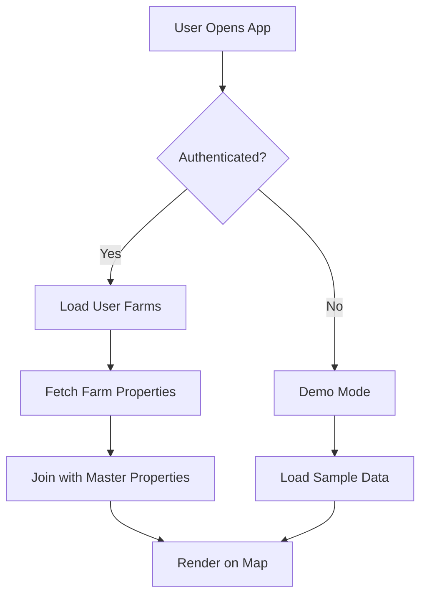

# Legacy Compass System Architecture

## Overview
Legacy Compass is a Progressive Web Application (PWA) designed as the "Bloomberg Terminal of Real Estate" - a comprehensive property management and door-knocking system for real estate professionals. The system combines modern web technologies with a scalable cloud backend to provide real-time property data, mapping, and customer relationship management.

## Technology Stack

### Frontend Architecture

#### Core Technologies
- **Alpine.js 3.13.0** - Reactive UI framework for component state management
- **Mapbox GL JS / TomTom Maps SDK** - Interactive map visualization with 3D terrain support
- **Tailwind CSS** - Utility-first CSS framework for responsive design
- **Leaflet 1.9.4** - Alternative mapping library for lightweight deployments

#### UI/UX Design Principles (Updated Sept 2025)
- **Mobile-First Responsive Design** - Optimized for PWA on mobile devices
- **Touch-Optimized Interface** - 50-60px touch targets following Apple HIG
- **Professional Color Palette** - Navy/dark theme with orange accents
- **No-Scroll Detail Views** - All content visible without scrolling on mobile

#### Key Frontend Components

```javascript
// Main Application Controller Structure
class LegacyCompass {
  constructor() {
    this.version = '1.0.0';
    this.properties = [];         // Property data store
    this.map = null;              // Map controller instance
    this.ai = null;               // AI Assistant integration
    this.storage = null;          // Local/cloud storage manager
    this.enrichment = null;       // Data enrichment service
    this.voice = null;            // Voice recording handler
  }
}
```

#### Frontend File Structure (Updated Sept 2025)
```
Legacy_Compass/
├── index.html              # Main PWA application (unified)
├── css/
│   ├── styles.css         # Main stylesheet
│   └── tailwind/          # Tailwind utilities
├── js/
│   ├── app.js             # Main application controller
│   ├── auth.js            # Authentication module
│   ├── supabase-client.js # Supabase connection
│   ├── user-data.js       # User data management
│   ├── map-controller.js  # Map interaction logic
│   ├── voice-handler.js   # Voice notes functionality
│   ├── smart-csv-loader.js # CSV import/parsing
│   └── offline-map-manager.js # PWA offline support
├── assets/
│   └── icons/             # PWA icons (72x72 to 512x512)
└── architecture/          # System documentation
    ├── CHANGELOG.md       # Version history
    ├── SYSTEM_ARCHITECTURE.md # This file
    └── IMPLEMENTATION_GUIDE.md # Setup instructions
```

### Backend Architecture

#### Supabase Infrastructure
- **PostgreSQL Database** - Primary data store with Row Level Security (RLS)
- **Authentication Service** - JWT-based auth with email/password and social logins
- **Real-time Subscriptions** - WebSocket connections for live updates
- **Edge Functions** - Serverless API endpoints for custom logic
- **Storage Buckets** - File storage for CSV uploads and voice recordings

#### API Connection Details
```javascript
// Supabase Client Configuration
const SUPABASE_URL = 'https://kfomddpbpsaplyucodli.supabase.co';
const SUPABASE_ANON_KEY = 'eyJhbGciOiJIUzI1NiIsInR5cCI6IkpXVCJ9...';

const supabase = createClient(SUPABASE_URL, SUPABASE_ANON_KEY, {
  auth: {
    persistSession: true,
    autoRefreshToken: true
  },
  realtime: {
    params: {
      eventsPerSecond: 10
    }
  }
});
```

## Database Schema

### Property Deduplication & Matching System

#### Data Sources & Gold Mine Strategy
The system combines multiple property data sources to create a comprehensive "gold mine" database:

1. **County Records (Primary Source)**
   - 48,555 Hayward properties from Alameda County Assessor
   - Contains official property records with APNs
   - Updated monthly via automated scripts
   - Fields: APN, owner name, address, tax info, sale history

2. **Title Company Data (Enrichment Layer)**  
   - Additional ownership details and liens
   - Chain of title information
   - Matched via APN (Assessor Parcel Number)
   - 99.2% successful match rate achieved

3. **MLS/Realtor Data (Market Layer)**
   - Current listings and recent sales
   - Property photos and descriptions
   - Matched by address + owner name fallback

#### Deduplication Process
```sql
-- APN is the unique identifier preventing duplicates
-- Each property can only exist once in master_properties
CREATE TABLE master_properties (
    apn TEXT PRIMARY KEY,  -- Unique constraint ensures no duplicates
    -- ... other fields
);

-- Import process checks for existing APNs
INSERT INTO master_properties (apn, property_address, ...)
VALUES ($1, $2, ...)
ON CONFLICT (apn) DO UPDATE SET
    property_address = EXCLUDED.property_address,
    last_updated = NOW()
    -- Updates existing record instead of creating duplicate
```

#### Matching Algorithm
1. **Primary Match: APN**
   - Most reliable identifier
   - Format: `XXX-XXXX-XXX-XX` (varies by county)
   - Used for county ↔ title company matching

2. **Secondary Match: Address Normalization**
   ```javascript
   // Address matching for sources without APN
   function normalizeAddress(address) {
       return address
           .toUpperCase()
           .replace(/\./g, '')
           .replace(/STREET/g, 'ST')
           .replace(/AVENUE/g, 'AVE')
           .replace(/DRIVE/g, 'DR');
   }
   ```

3. **Tertiary Match: Owner Name Fuzzy Matching**
   - Levenshtein distance for similar names
   - Handles variations (Bob vs Robert)
   - Trust score based on match confidence

### Core Tables

#### 1. master_properties
Central repository of all property data with 48,555+ Hayward properties.

```sql
CREATE TABLE master_properties (
    apn TEXT PRIMARY KEY,              -- Assessor Parcel Number (unique ID)
    property_address TEXT NOT NULL,
    owner_name TEXT,
    owner_address TEXT,
    is_absentee BOOLEAN DEFAULT false,
    is_vacant BOOLEAN DEFAULT false,
    property_value NUMERIC,
    equity_percentage NUMERIC,
    last_sale_date DATE,
    last_sale_price NUMERIC,
    property_type TEXT,
    bedrooms INTEGER,
    bathrooms NUMERIC,
    square_feet INTEGER,
    lot_size NUMERIC,
    year_built INTEGER,
    latitude NUMERIC,
    longitude NUMERIC,
    created_at TIMESTAMP DEFAULT NOW(),
    updated_at TIMESTAMP DEFAULT NOW()
);

-- Indexes for performance
CREATE INDEX idx_master_properties_address ON master_properties(property_address);
CREATE INDEX idx_master_properties_owner ON master_properties(owner_name);
CREATE INDEX idx_master_properties_absentee ON master_properties(is_absentee);
CREATE INDEX idx_master_properties_vacant ON master_properties(is_vacant);
CREATE INDEX idx_master_properties_location ON master_properties(latitude, longitude);
```

#### 2. user_farms
Private property collections for each user/agent.

```sql
CREATE TABLE user_farms (
    id UUID DEFAULT gen_random_uuid() PRIMARY KEY,
    user_id UUID REFERENCES auth.users(id) ON DELETE CASCADE,
    farm_name TEXT NOT NULL,
    description TEXT,
    territory_bounds JSONB,  -- GeoJSON polygon
    created_at TIMESTAMP DEFAULT NOW(),
    updated_at TIMESTAMP DEFAULT NOW()
);
```

#### 3. farm_properties
Junction table linking properties to farms with user-specific data.

```sql
CREATE TABLE farm_properties (
    id UUID DEFAULT gen_random_uuid() PRIMARY KEY,
    farm_id UUID REFERENCES user_farms(id) ON DELETE CASCADE,
    apn TEXT REFERENCES master_properties(apn),
    user_id UUID REFERENCES auth.users(id),
    
    -- User-specific property data
    status TEXT CHECK (status IN ('hot', 'warm', 'cold', 'contacted', 'not_interested')),
    notes TEXT,
    tags TEXT[],
    is_favorite BOOLEAN DEFAULT false,
    
    -- Contact tracking
    last_contact_date TIMESTAMP,
    next_followup_date TIMESTAMP,
    contact_attempts INTEGER DEFAULT 0,
    
    -- Voice notes as JSON array
    voice_notes JSONB DEFAULT '[]',
    
    -- Enrichment data
    phone_numbers JSONB DEFAULT '[]',
    email_addresses JSONB DEFAULT '[]',
    
    created_at TIMESTAMP DEFAULT NOW(),
    updated_at TIMESTAMP DEFAULT NOW(),
    
    UNIQUE(farm_id, apn)
);
```

#### 4. property_enrichments
Shared enrichment data visible to all agents.

```sql
CREATE TABLE property_enrichments (
    id UUID DEFAULT gen_random_uuid() PRIMARY KEY,
    apn TEXT REFERENCES master_properties(apn),
    data_type TEXT NOT NULL, -- 'phone', 'email', 'social', etc.
    data_value TEXT NOT NULL,
    confidence_score NUMERIC DEFAULT 0.5,
    source TEXT,  -- 'manual', 'ai', 'import', etc.
    verified BOOLEAN DEFAULT false,
    added_by UUID REFERENCES auth.users(id),
    created_at TIMESTAMP DEFAULT NOW(),
    
    UNIQUE(apn, data_type, data_value)
);
```

### Row Level Security (RLS) Policies

```sql
-- Users can only see their own farms
CREATE POLICY "Users view own farms" ON user_farms
    FOR SELECT USING (auth.uid() = user_id);

-- Users can only modify their own farm properties
CREATE POLICY "Users manage own properties" ON farm_properties
    FOR ALL USING (auth.uid() = user_id);

-- All authenticated users can view enrichment data
CREATE POLICY "View enrichments" ON property_enrichments
    FOR SELECT USING (auth.role() = 'authenticated');

-- All authenticated users can add enrichments
CREATE POLICY "Add enrichments" ON property_enrichments
    FOR INSERT WITH CHECK (auth.uid() = added_by);
```

## Authentication Flow

### Login/Signup Process

```javascript
// Authentication Module (auth.js)
const Auth = {
    async signIn(email, password) {
        const { data, error } = await supabase.auth.signInWithPassword({
            email,
            password
        });
        
        if (data.user) {
            // Log activity
            await this.logActivity(data.user.id, null, 'login');
            
            // Initialize user data
            await UserData.init();
            
            // Load user farms
            await this.loadUserFarms();
        }
        
        return data;
    },
    
    async signUp(email, password, fullName) {
        const { data, error } = await supabase.auth.signUp({
            email,
            password,
            options: {
                data: { full_name: fullName }
            }
        });
        
        // Create initial user settings
        if (data.user) {
            await this.createUserSettings(data.user.id);
        }
        
        return data;
    }
};
```

### Session Management

```javascript
// Check authentication state on app load
supabase.auth.onAuthStateChange((event, session) => {
    if (event === 'SIGNED_IN') {
        // User signed in
        window.location.reload();
    } else if (event === 'SIGNED_OUT') {
        // Clear local data
        localStorage.clear();
        window.location.href = '/login';
    }
});
```

## Data Flow Architecture

### 1. Property Data Loading



### 2. CSV Import Process

```javascript
// Smart CSV Loader (smart-csv-loader.js)
class SmartCSVLoader {
    async processCSV(file) {
        // 1. Parse CSV file
        const data = await this.parseCSV(file);
        
        // 2. Detect column mappings
        const mappings = this.detectColumns(data.headers);
        
        // 3. Geocode addresses if needed
        const geocoded = await this.geocodeAddresses(data.rows);
        
        // 4. Match with master database
        const matched = await this.matchWithMaster(geocoded);
        
        // 5. Save to user's farm
        const saved = await this.saveToFarm(matched);
        
        return {
            total: data.rows.length,
            matched: matched.length,
            saved: saved.length
        };
    }
}
```

### 3. Real-time Sync Architecture

```javascript
// Real-time property updates
const subscription = supabase
    .channel('property-updates')
    .on('postgres_changes', 
        { 
            event: '*', 
            schema: 'public', 
            table: 'farm_properties',
            filter: `user_id=eq.${currentUser.id}`
        },
        (payload) => {
            // Handle real-time updates
            if (payload.eventType === 'INSERT') {
                addPropertyToMap(payload.new);
            } else if (payload.eventType === 'UPDATE') {
                updatePropertyOnMap(payload.new);
            } else if (payload.eventType === 'DELETE') {
                removePropertyFromMap(payload.old);
            }
        }
    )
    .subscribe();
```

## Map Integration

### Mapbox GL Configuration

```javascript
// Map initialization with custom style
const map = new mapboxgl.Map({
    container: 'map',
    style: 'mapbox://styles/mapbox/satellite-streets-v12',
    center: [-122.0855, 37.6688], // Hayward, CA
    zoom: 12,
    pitch: 45,  // 3D tilt
    bearing: -17.6,
    antialias: true
});

// Add 3D buildings
map.on('load', () => {
    map.addLayer({
        'id': '3d-buildings',
        'source': 'composite',
        'source-layer': 'building',
        'filter': ['==', 'extrude', 'true'],
        'type': 'fill-extrusion',
        'paint': {
            'fill-extrusion-color': '#aaa',
            'fill-extrusion-height': ['get', 'height'],
            'fill-extrusion-opacity': 0.6
        }
    });
});
```

### Property Markers and Clustering

```javascript
// Add clustered property markers
map.addSource('properties', {
    type: 'geojson',
    data: propertyGeoJSON,
    cluster: true,
    clusterMaxZoom: 14,
    clusterRadius: 50
});

// Cluster circles
map.addLayer({
    id: 'clusters',
    type: 'circle',
    source: 'properties',
    filter: ['has', 'point_count'],
    paint: {
        'circle-color': [
            'step',
            ['get', 'point_count'],
            '#51bbd6', 10,
            '#f1f075', 30,
            '#f28cb1'
        ],
        'circle-radius': [
            'step',
            ['get', 'point_count'],
            20, 10,
            30, 30,
            40
        ]
    }
});
```

## PWA Architecture

### Service Worker Strategy

```javascript
// Service Worker (sw.js)
const CACHE_NAME = 'legacy-compass-v1';
const urlsToCache = [
    '/',
    '/css/styles.css',
    '/js/app.js',
    '/offline.html'
];

// Cache-first strategy for static assets
self.addEventListener('fetch', (event) => {
    if (event.request.url.includes('/api/')) {
        // Network-first for API calls
        event.respondWith(
            fetch(event.request)
                .then(response => {
                    // Cache successful responses
                    const responseClone = response.clone();
                    caches.open(CACHE_NAME).then(cache => {
                        cache.put(event.request, responseClone);
                    });
                    return response;
                })
                .catch(() => {
                    // Fallback to cache
                    return caches.match(event.request);
                })
        );
    } else {
        // Cache-first for static assets
        event.respondWith(
            caches.match(event.request)
                .then(response => response || fetch(event.request))
        );
    }
});
```

### Offline Capabilities

```javascript
// IndexedDB for offline data storage
class OfflineStorage {
    constructor() {
        this.dbName = 'LegacyCompassOffline';
        this.version = 1;
    }
    
    async init() {
        this.db = await this.openDB();
        
        // Sync when back online
        window.addEventListener('online', () => {
            this.syncWithServer();
        });
    }
    
    async saveProperty(property) {
        const tx = this.db.transaction(['properties'], 'readwrite');
        const store = tx.objectStore('properties');
        
        // Add sync flag for later upload
        property._syncPending = true;
        property._timestamp = Date.now();
        
        await store.put(property);
    }
    
    async syncWithServer() {
        const tx = this.db.transaction(['properties'], 'readonly');
        const store = tx.objectStore('properties');
        const pendingSync = await store.index('syncPending').getAll(true);
        
        for (const property of pendingSync) {
            try {
                await this.uploadToSupabase(property);
                // Remove sync flag
                delete property._syncPending;
                await store.put(property);
            } catch (error) {
                console.error('Sync failed for property:', property.id);
            }
        }
    }
}
```

## Performance Optimizations

### 1. Data Loading Strategy

```javascript
// Lazy loading with virtual scrolling
class VirtualList {
    constructor(container, items, rowHeight) {
        this.container = container;
        this.items = items;
        this.rowHeight = rowHeight;
        this.visibleRange = { start: 0, end: 50 };
    }
    
    render() {
        const scrollTop = this.container.scrollTop;
        const containerHeight = this.container.clientHeight;
        
        // Calculate visible items
        this.visibleRange.start = Math.floor(scrollTop / this.rowHeight);
        this.visibleRange.end = Math.ceil((scrollTop + containerHeight) / this.rowHeight);
        
        // Render only visible items
        this.renderVisibleItems();
    }
}
```

### 2. Map Performance

```javascript
// Viewport-based loading
map.on('moveend', debounce(() => {
    const bounds = map.getBounds();
    
    // Load only properties in viewport
    loadPropertiesInBounds(bounds)
        .then(properties => {
            updateMapMarkers(properties);
        });
}, 500));

// Level of Detail (LOD) system
map.on('zoom', () => {
    const zoom = map.getZoom();
    
    if (zoom < 12) {
        // Show clusters only
        map.setLayoutProperty('clusters', 'visibility', 'visible');
        map.setLayoutProperty('property-markers', 'visibility', 'none');
    } else {
        // Show individual properties
        map.setLayoutProperty('clusters', 'visibility', 'none');
        map.setLayoutProperty('property-markers', 'visibility', 'visible');
    }
});
```

### 3. Caching Strategy

```javascript
// Multi-layer caching
class CacheManager {
    constructor() {
        this.memoryCache = new Map();
        this.sessionCache = window.sessionStorage;
        this.localCache = window.localStorage;
    }
    
    async get(key) {
        // L1: Memory cache
        if (this.memoryCache.has(key)) {
            return this.memoryCache.get(key);
        }
        
        // L2: Session storage
        const sessionData = this.sessionCache.getItem(key);
        if (sessionData) {
            const data = JSON.parse(sessionData);
            this.memoryCache.set(key, data);
            return data;
        }
        
        // L3: Local storage
        const localData = this.localCache.getItem(key);
        if (localData) {
            const data = JSON.parse(localData);
            this.memoryCache.set(key, data);
            this.sessionCache.setItem(key, JSON.stringify(data));
            return data;
        }
        
        // L4: Fetch from server
        const data = await this.fetchFromServer(key);
        this.set(key, data);
        return data;
    }
}
```

## Security Architecture

### 1. Authentication Security

```javascript
// JWT token validation
supabase.auth.onAuthStateChange((event, session) => {
    if (session) {
        // Verify token hasn't expired
        const expiresAt = session.expires_at;
        const now = Math.floor(Date.now() / 1000);
        
        if (expiresAt < now) {
            // Refresh token
            supabase.auth.refreshSession();
        }
    }
});
```

### 2. Data Security

```sql
-- Row Level Security ensures data isolation
ALTER TABLE farm_properties ENABLE ROW LEVEL SECURITY;

-- Users can only access their own data
CREATE POLICY "Isolate user data" ON farm_properties
    USING (auth.uid() = user_id);
    
-- Prevent data leakage through functions
CREATE OR REPLACE FUNCTION get_user_properties(user_uuid UUID)
RETURNS SETOF farm_properties
LANGUAGE sql
SECURITY DEFINER
AS $$
    SELECT * FROM farm_properties 
    WHERE user_id = user_uuid 
    AND user_uuid = auth.uid(); -- Double check
$$;
```

### 3. API Security

```javascript
// Request signing and rate limiting
class SecureAPI {
    constructor() {
        this.requestCount = 0;
        this.resetTime = Date.now() + 60000; // 1 minute
        this.maxRequests = 100;
    }
    
    async request(endpoint, options = {}) {
        // Rate limiting
        if (this.requestCount >= this.maxRequests) {
            if (Date.now() < this.resetTime) {
                throw new Error('Rate limit exceeded');
            }
            this.requestCount = 0;
            this.resetTime = Date.now() + 60000;
        }
        
        // Add auth headers
        const { data: { session } } = await supabase.auth.getSession();
        options.headers = {
            ...options.headers,
            'Authorization': `Bearer ${session.access_token}`,
            'X-Request-ID': crypto.randomUUID(),
            'X-Client-Version': APP_VERSION
        };
        
        this.requestCount++;
        return fetch(endpoint, options);
    }
}
```

## Deployment Architecture

### Production Environment

```yaml
# Docker Compose for local development
version: '3.8'
services:
  app:
    build: .
    ports:
      - "3000:3000"
    environment:
      - SUPABASE_URL=${SUPABASE_URL}
      - SUPABASE_ANON_KEY=${SUPABASE_ANON_KEY}
      - MAPBOX_TOKEN=${MAPBOX_TOKEN}
    volumes:
      - ./Legacy_Compass:/app
```

### Vercel Deployment

```json
// vercel.json
{
  "version": 2,
  "builds": [
    {
      "src": "Legacy_Compass/**",
      "use": "@vercel/static"
    }
  ],
  "routes": [
    {
      "src": "/(.*)",
      "dest": "/Legacy_Compass/$1"
    }
  ],
  "env": {
    "SUPABASE_URL": "@supabase_url",
    "SUPABASE_ANON_KEY": "@supabase_anon_key",
    "MAPBOX_TOKEN": "@mapbox_token"
  }
}
```

## Monitoring and Analytics

### Performance Monitoring

```javascript
// Web Vitals tracking
import { getCLS, getFID, getFCP, getLCP, getTTFB } from 'web-vitals';

function sendToAnalytics(metric) {
    // Send to your analytics endpoint
    const body = JSON.stringify({
        name: metric.name,
        value: metric.value,
        id: metric.id,
        navigationType: metric.navigationType
    });
    
    // Use sendBeacon for reliability
    navigator.sendBeacon('/analytics', body);
}

getCLS(sendToAnalytics);
getFID(sendToAnalytics);
getFCP(sendToAnalytics);
getLCP(sendToAnalytics);
getTTFB(sendToAnalytics);
```

### Error Tracking

```javascript
// Global error handler
window.addEventListener('error', (event) => {
    const errorData = {
        message: event.error.message,
        stack: event.error.stack,
        url: window.location.href,
        userAgent: navigator.userAgent,
        timestamp: new Date().toISOString()
    };
    
    // Log to Supabase
    supabase.from('error_logs').insert(errorData);
    
    // Prevent default error handling in production
    if (ENVIRONMENT === 'production') {
        event.preventDefault();
    }
});
```

## System Integration Points

### 1. Ghost AI Integration
```javascript
// AI-powered property enrichment
class GhostAI {
    async enrichProperty(property) {
        const response = await fetch(`${GHOST_API_URL}/enrich`, {
            method: 'POST',
            headers: { 'Content-Type': 'application/json' },
            body: JSON.stringify({
                address: property.address,
                owner: property.owner_name
            })
        });
        
        return response.json();
    }
}
```

### 2. GROQ LLM Integration
```javascript
// Natural language property search
class GroqSearch {
    async search(query) {
        const response = await fetch('https://api.groq.com/v1/completions', {
            method: 'POST',
            headers: {
                'Authorization': `Bearer ${GROQ_API_KEY}`,
                'Content-Type': 'application/json'
            },
            body: JSON.stringify({
                model: 'mixtral-8x7b-32768',
                prompt: `Find properties matching: ${query}`,
                max_tokens: 500
            })
        });
        
        return response.json();
    }
}
```

## Scalability Considerations

### Database Scaling
- Partitioning by geographic region
- Read replicas for heavy query loads
- Connection pooling via PgBouncer
- Materialized views for complex queries

### Application Scaling
- CDN for static assets (Cloudflare/Fastly)
- Edge functions for API endpoints
- WebSocket connection management
- Queue-based background processing

### Data Scaling
- Pagination with cursor-based navigation
- Incremental data loading
- Compression for large datasets
- Archive old/inactive records

## Future Architecture Enhancements

1. **Microservices Migration**
   - Separate enrichment service
   - Independent mapping service
   - Dedicated analytics service

2. **Machine Learning Pipeline**
   - Property valuation models
   - Lead scoring algorithms
   - Predictive analytics

3. **Mobile Native Apps**
   - React Native implementation
   - Native map SDKs
   - Offline-first architecture

4. **Real-time Collaboration**
   - WebRTC for team features
   - Operational Transform for concurrent editing
   - Presence awareness

---

This architecture document represents the current state of the Legacy Compass system as of January 2025. Regular updates should be made as the system evolves.